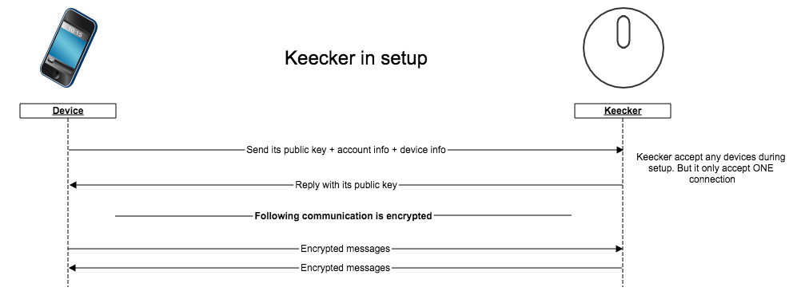
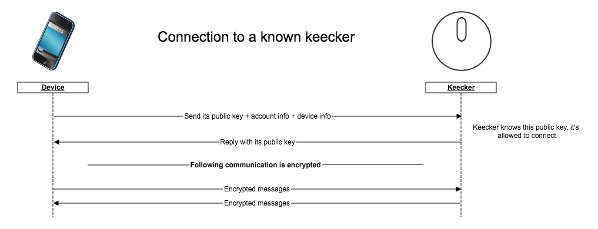
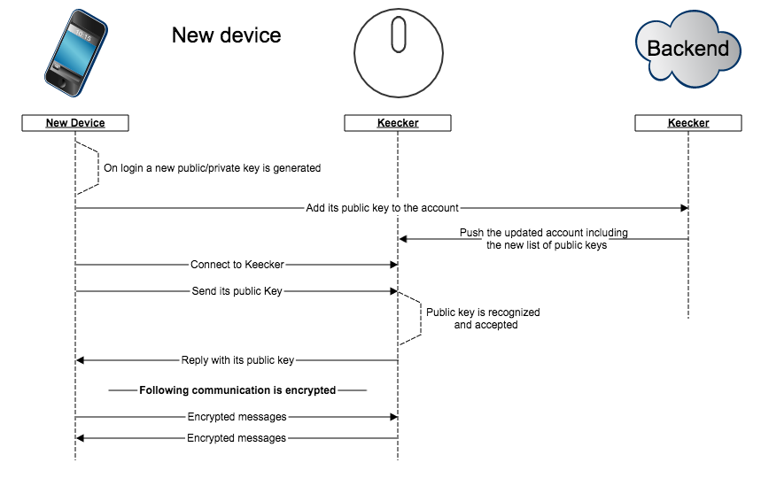
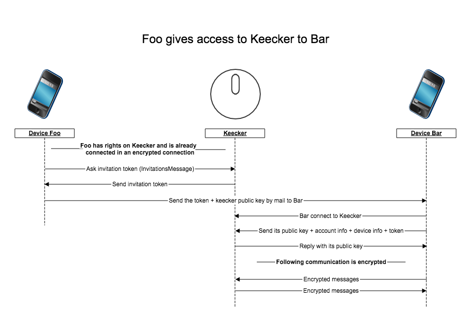

This page explains how a **Keecker** can authenticate a **Account** connecting from a **Device**.  

# Goals
* Keecker must identify the connecting device and account
* Keecker must check if the connecting account is allowed to communicate with him
* The communication must be private to Keecker and the device, that is only Keecker and the device should be able to understand the message transiting between them
* An account can provide access to another account even when not connected to internet
* Internet access will be mandatory on both Keecker and the device when setupping Keecker
* Factory resetting a Keecker will remove access of all the devices and should create a new identity to Keecker.

# Implementation
Most of authentication and security on Keecker is based on a [public key cryptography](https://en.wikipedia.org/wiki/Public-key_cryptography). We chose to rely on [libsodium](https://download.libsodium.org/doc/) for the implementation.

* All devices and Keecker have a pair of public and private key.
* Communication between a Keecker and a devices always starts by an exchange of authenticating data which always includes public key of the device and Keecker. Once this exchange is made the communication is encrypted which makes it private to only Keecker and the device.
* A device or a Keecker is identified by the public key he sent during the connection
* In setup, Keecker accepts any devices
* After setup Keecker only accepts device whose public key are already known or devices which provide an invitation token provided and checkable by Keecker.

# Use cases

## Setup

As long as its setup is not finished, Keecker accepts any devices but will:
* Only accepts one connection at a time
* Always use an encrypted connection

At the end of the setup, only the last device connected will keep access rights to Keecker.

## Connection to a known Keecker

Keecker has a list of the devices allowed to connect to him, for a normal connection Keecker will simply checks if the connecting device is in this list and accept or refuse the connection.

## Connecting from a new device (same account)

When the user login on a new devices, this device adds its public key to the backend and the backend pushes the new Key to Keecker. Once Keecker has the new key the device will be authorized to connect as a normal connection.
**New device can only connect to Keecker if keecker and the new device both have internet access.**

## Giving access to another account

The key point of the invitation is that token are generated and accepted on Keecker. In this case too Keecker is directly able to know if a given token is valid or not.
The mail sent to Bar contains a deeplink which should either open the app or point to the correct store to install the app.

